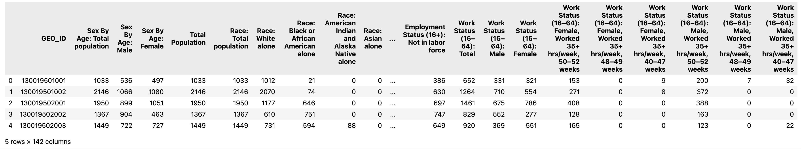

# Healthcare Accessibility Shifts Analysis During COVID-19 Using Mobility Data

This repository contains code and notebooks for the study:

**"Dissecting Healthcare Accessibility Shifts during COVID-19 using Mobility Data"**

We integrate large-scale mobility data with interpretable machine learning to examine year-over-year changes in healthcare accessibility between 2019 and 2022, focusing on four service types:
- Adult Primary Care
- Pediatric Primary Care
- Emergency Room Visits
- Urgent Care Visits

## Repository Structure

- **main.ipynb**  
  Jupyter notebook that reproduces the main analyses and visualizations for the study.  
  - Loads accessibility data for each Census Block Group (CBG) and healthcare category for years 2019–2023.
  - Uses `access_cal.py` to generate accessibility data.
  - Visualizes year-over-year accessibility changes for the four healthcare categories.
  - Applies CatBoost regressors and SHAP values for model interpretation.

- **access_cal.py**  
  Python script to generate accessibility metrics for each CBG and healthcare category for each year (2019–2023).
  - Reads weekly mobility data (in Parquet format) and filters for healthcare-related NAICS codes.
  - Processes and aggregates visit data for each healthcare service type.
  - Loads demographic and geographic data for CBGs.
  - Calculates a distance-decay weighted accessibility score for each CBG.
  - Outputs results as CSV files (e.g., `2019_Adult Primary Care_access.csv`).
- **catboost0727.py**  
  Python script for advanced statistical and machine learning analysis of healthcare accessibility changes.
  - Loads precomputed accessibility difference data and demographic features.
  - Cleans and preprocesses the data, including log transformations and feature engineering (e.g., metro area indicator).
  - Merges accessibility and demographic data for each CBG.
  - For each healthcare category, fits a CatBoost regressor to model the log-percentage change in accessibility between 2020 and 2022.
  - Performs hyperparameter tuning and evaluates model performance using R², MSE, RMSE, and MAE.
  - Uses SHAP (SHapley Additive exPlanations) to interpret feature importance and visualize the drivers of accessibility change.
  - Outputs summary statistics and saves SHAP plots for each category.

## Data Requirements

- **Mobility Data:**  
  Weekly patterns data in Parquet format for each year (e.g., `/combined_GA_weekly_patterns_2019.parquet`).
  The data description can be found at: https://docs.deweydata.io/docs/advan-research-weekly-patterns
  The data column headers are:
  ['placekey', 'parent_placekey', 'safegraph_brand_ids', 'location_name',
       'brands', 'store_id', 'top_category', 'sub_category', 'naics_code',
       'latitude', 'longitude', 'street_address', 'city', 'region',
       'postal_code', 'open_hours', 'category_tags', 'opened_on', 'closed_on',
       'tracking_closed_since', 'websites', 'geometry_type', 'polygon_wkt',
       'polygon_class', 'enclosed', 'phone_number', 'is_synthetic',
       'includes_parking_lot', 'iso_country_code', 'wkt_area_sq_meters',
       'date_range_start', 'date_range_end', 'raw_visit_counts',
       'raw_visitor_counts', 'visits_by_day', 'visits_by_each_hour', 'poi_cbg',
       'visitor_home_cbgs', 'visitor_home_aggregation', 'visitor_daytime_cbgs',
       'visitor_country_of_origin', 'distance_from_home', 'median_dwell',
       'bucketed_dwell_times', 'related_same_day_brand',
       'related_same_week_brand', 'device_type',
       'normalized_visits_by_state_scaling',
       'normalized_visits_by_region_naics_visits',
       'normalized_visits_by_region_naics_visitors',
       'normalized_visits_by_total_visits',
       'normalized_visits_by_total_visitors']
- **Demographic Data:**  
  Yearly demographic CSVs in `dempgraphic_DCA/` (e.g., `dempgraphic_DCA/2019.csv`). The data is collected from the U.S. Census Bureau, American Community Survey 5-Year Estimates, 2019 - 2023.
  The example headers are:

- **Geographic Data:**  
  Shapefile for CBGs (e.g., `tl_2019_13_bg.shp`).

## Usage

1. **Generate Accessibility Data:**
   - Run `access_cal.py` to process raw data and output accessibility CSVs for each year and category.

2. **Reproduce Analysis and Visualizations:**
   - Open `main.ipynb` in Jupyter.
   - Follow the notebook to load, analyze, and visualize accessibility changes.
3. **Run Machine Learning Analysis:**
 - Execute `catboost0727.py` to perform regression analysis and generate SHAP plots for feature interpretation.

## Dependencies

- Python 3.x
- pandas
- geopandas
- numpy
- matplotlib
- seaborn
- catboost
- shap
- scikit-learn
- scipy
- (and other standard scientific Python libraries)

Install dependencies with:
```bash
pip install pandas geopandas numpy matplotlib catboost shap
```

## Outputs

- Accessibility CSVs for each year and healthcare category (e.g., `2019_Adult Primary Care_access.csv`).
- Visualizations and model interpretation plots in the notebook.
- SHAP summary and bar plots for each healthcare category (saved in the `shap_plots/` directory).
